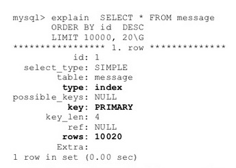
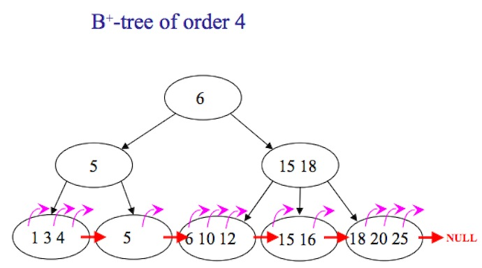
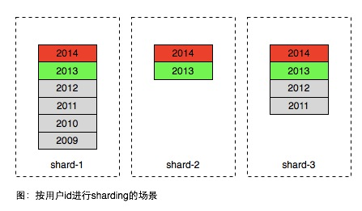
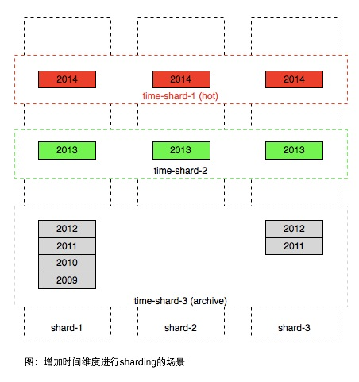
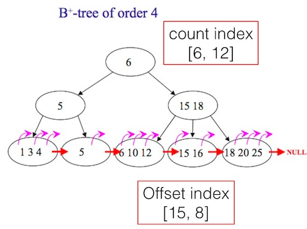

#为什么超长列表数据的翻页技术实现复杂

今天讨论了一个传统的问题，问题本身比较简单，就是针对key-list类型的数据，如何优化方案做到性能与成本的tradeoff。Key-list在用户类型的产品中非常普遍，如一个用户的好友关系 {“uid”:{1,2,3,4,5}}，表示uid包含有5个好友；一条微博下面的评论id列表{“weibo_id”: {comment_id1, comment_id2……}}，一个用户发表的微博id列表等。

在list长度较少时候，我们可以直接的使用数据库的翻页功能，如

```
SELECT * FROM LIST_TABLE LIMIT offset, row_count;
```
根据经验，在大部分场景下，单个业务的list数据长度99%在1000条以下，在数据规模较小时候，上面的方法非常适合。但剩下的1%的数据可能多达100万条，我们把这种单个列表记录数非常大的数据集合称为超长列表。在超长列表中，当访问offset较大的数据，上述方法非常低效（可参看Why does MYSQL higher LIMIT offset slow the query down?），但在实现方案的时候不能忽视这些超长列表的问题，因此要实现一个适合各种变长list的翻页方案，考虑到数据的长尾问题，并没有简单高效的方案。这也体现了常说的80%的时间在优化20%的功能。

List数据访问模型常见的有两种方式

###1. 扶梯方式
扶梯方式在导航上通常只提供上一页/下一页这两种模式，部分产品甚至不提供上一页功能，只提供一种“更多/more”的方式，也有下拉自动加载更多的方式，在技术上都可以归纳成扶梯方式


（图：blogspot的导航条）

  

（图：很多瀑布流式的产品只提供一个more的导航条）

扶梯方式在技术实现上比较简单及高效，根据当前页最后一条的偏移往后获取一页即可，在MySQL可使用以下方法实现。

```
SELECT * FROM LIST_TABLE WHERE id > offset_id LIMIT n;

```

由于where条件中指定了位置，因此算法复杂度是O(log n)

###2. 电梯方式
另外一种数据获取方式在产品上体现成精确的翻页方式，如1,2,3……n，同时在导航上也可以由用户输入直达n页。国内大部分产品经理对电梯方式有特殊的喜好，如图


（图：timyang.net 网站的导航条）

但电梯方式在技术实现上相对成本较高，当使用以下SQL时

```
SELECT * FROM LIST_TABLE LIMIT offset, row_count;

```

我们可以使用MySQL explain来分析，从下文可以看到，当offset=10000时候，实际上MySQL也扫描了10000行记录。



为什么会这样？在MySQL中，索引通常是b-tree方式（但存储引擎如InnoDB实际是b+tree），如图



从图中可以看到，使用电梯方式时候，当用户指定翻到第n页时候，并没有直接方法寻址到该位置，而是需要从第一楼逐个count，scan到count*page时候，获取数据才真正开始，所以导致效率不高。对应的算法复杂度是O(n)，n指offset，也就是page*count。

另外Offset并不能有效的缓存，这是由于

- 1、在数据存在新增及删除的情况下，只要有一条变化，原先的楼层可能会全部发生变化。在一个用户并发访问的场景，频繁变化的场景比较常见。
- 2、电梯使用比较离散，可能一个20万条的list，用户使用了一次电梯直达100楼之后就走了，这样即使缓存100楼之下全部数据也不能得到有效利用。

以上描述的场景属于单机版本，在数据规模较大时候，互联网系统通常使用分库的方式来保存，实现方法更为复杂。
在面向用户的产品中，数据分片通常会将同一用户的数据存在相同的分区，以便更有效率的获取当前用户的数据。如下图所示



（图：数据按用户uid进行hash拆分）

图中的不同年份的数据的格子是逻辑概念，实际上同一用户的数据是保存在一张表中。因此方案在常见的使用场景中存在很大不足，大部分产品用户只访问最近产生的数据，历史的数据只有极小的概率被访问到，因此同一个区域内部的数据访问是非常不均匀，如图中2014年生成的属于热数据，2012年以前的属于冷数据，只有极低的概率被访问到。但为了承担红色部分的访问，数据库通常需要高速昂贵的设备如SSD，因此上面方案所有的数据都需要存在SSD设备中，即使这些数据已经不被访问。

简单的解决方案是按时间远近将数据进行进一步分区，如图。



注意在上图中使用时间方式sharding之后，在一个时间分区内，也需要用前一种方案将数据进行sharding，因为一个时间片区通常也无法用一台服务器容纳。

上面的方案较好的解决了具体场景对于key list访问性能及成本的tradeoff，但是它存在以下不足

- 数据按时间进行滚动无法全自动，需要较多人为介入或干预
- 数据时间维度需要根据访问数据及模型进行精巧的设计，如果希望实现一个公用的key-list服务来存储所有业务的数据，这个公用服务可能很难实现
- 为了实现电梯直达功能，需要增加额外的二级索引，比如2013年某用户总共有多少条记录
由于以上问题，尤其是二级索引的引入，显然它不是理想中的key list实现，后文继续介绍适合超长列表翻页key list设计的一些思路及尝试。


##为什么超长列表数据的翻页技术实现复杂（二）

前新浪同事 @pi1ot 最近在程序员杂志发表的一篇文章《门户级UGC系统的技术进化路线》也是超长列表的一个经典案例，在正式展开思路之前，我们也不妨了解一下此文所说新浪评论系统的演进思路。

从文中看到几个版本的列表翻页实现方案

##3.0版

>3.0系统的缓存模块设计的比较巧妙，以显示页面为单位缓存数据，因为评论页面是依照提交时间降序排列，每新增一条新评论，所有帖子都需要向下移动一位，所以缓存格式设计为每两页数据一个文件，前后相邻的两个文件有一页的数据重复，最新的缓存文件通常情况下不满两页数据。

此方案由于每页的条数是定长的，因此主要采用缓存所有列表的方案。但为了数据更新的便利，缓存结构比较复杂。从今天多年之后的眼光来看，这种设计不利于理解、扩展及维护。因此目前大多不倾向使用这种方案。

##4.0版

>解决方案是在MySQL数据库和页面缓存模块之间，新建一个带索引的数据文件层，每条新闻的所有评论都单独保存在一个索引文件和一个数据文件中，期望通过把对数据库单一表文件的读写操作，分解为文件系统上互不干涉可并发执行的读写操作，来提高系统并发处理能力。在新的索引数据模块中，查询评论总数、追加评论、更新评论状态都是针对性优化过的高效率操作。从这时候起，MySQL数据库就降到了只提供归档备份和内部管理查询的角色，不再直接承载任何用户更新和查询请求了

使用自定义索引的方式，由于未与相关人员交流细节，推断应该是类似数组的结构。

从上述案例看到，评论系统是一种典型的超长列表数据结构，如果再MySQL的基础上来做，需要设计额外的索引结构来实现高效的翻页功能。

由于超长列表的翻页实现成本高主要是由于列表索引的B-TREE结构方面原因，B-TREE结构能快速查找到某个key，但不是为叶子节点的Range访问而设计，因此主要解决思路也是围绕B-TREE的range访问而进行优化。

首先、从原理来看，可以在B-TREE增加以下2个二级索引字段：

- Count index 记录每个非叶子节点下的条目数，这样可以帮助快速定位到任意的offset；
- Offset index 记录部分叶子节点的offset，比如每隔1000个id记录一个offset如下，并保存在另外一个列表中，当需要查找某个offset的时候，则可以利用附近已经记录offset的id来定位目的地位置。比如当翻页到1010时，如果offset index记录了[1000: id10345]，则可以从id10345往后10个元素找到10010。

```
[
{"1000":10345},
{"2000":13456},
{"3000":22345},
{"4000":56789},
{"5000":66788}
]

```

这2个字段可以同时使用，也可以只用其中一个。如图



再看如何将上述方法应用到具体的实现中。由于本文主要讨论MySQL环境，MySQL要在B-TREE上额外保存一些信息需要修改MySQL源代码，修改门槛较高，因此更简单方法是将上述二级索引通过应用层保存在另外的表中。

###一种非严格意义的count index实现如下：

```
CREATE TABLE IF NOT EXISTS `second_index` (
  `id` int(11) NOT NULL AUTO_INCREMENT,
  `uid` int(11) NOT NULL,
  `yymm` int(11) NOT NULL,
  `index_count` int(11) NOT NULL,
  PRIMARY KEY (`id`)
) ENGINE=InnoDB  DEFAULT CHARSET=utf8;


INSERT INTO `second_index` (`id`, `uid`, `yymm`, `index_count`) VALUES
(1, 1, 1409, 123),
(2, 1, 1410, 2342),
(3, 1, 1411, 534),
(4, 1, 1412, 784),
(5, 1, 1501, 845);

```

###一种offset index实现如下：
在第一次用户翻页到某个offset位置时，在redis直接保存offset, id。当有其他请求来查找offset之后数据时，可以从offset的位置往后扫描。如果列表的数据发生了变化，需要及时将Redis保存的offset index删除。

以上2种方法已经在生产环境使用。