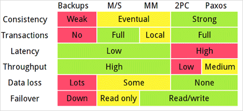

#多IDC的数据分布设计(一)

上个月跟某个朋友谈及多IDC数据同时读写访问的问题(tweet)，当时觉得有不少解决方案，但觉得思路还不够清晰。最近看了Google App Engine工程师Ryan Barrett介绍GAE后端数据服务的演讲稿[Transactions Across Datacenters(视频)](http://snarfed.org/space/transactions_across_datacenters_io.html)，用Ryan的方法来分析这个问题后就豁然开朗。

按Ryan的方法，多IDC实现有以下几种思路。

###一、Master/slave  

这个是多机房数据访问最常用的方案，一般的需求用此方案即可。因此大家也经常提到“premature optimization is the root of all evil”。  

优点：利用mysql replication即可实现，成熟稳定。  
缺点：写操作存在单点故障，master坏掉之后slave不能写。另外slave的延迟也是个困扰人的小问题。

###二、Multi-master

Multi-master指一个系统存在多个master, 每个master都具有read-write能力，需根据时间戳或业务逻辑合并版本。比如分布式版本管理系统git可以理解成multi-master模式。具备最终一致性。多版本数据修改可以借鉴Dynamo的vector clock等方法。

优点：解决了单点故障。  
缺点：不易实现一致性，合并版本的逻辑复杂。

###三、Two-phase commit(2PC)

[Two-phase commit](http://en.wikipedia.org/wiki/Two-phase_commit_protocol)是一个比较简单的一致性算法。由于一致性算法通常用神话(如Paxos的The Part-Time Parliament论文)来比喻容易理解，下面也举个类似神话的例子。

某班要组织一个同学聚会，前提条件是所有参与者同意则活动举行，任意一人拒绝则活动取消。用2PC算法来执行过程如下

####Phase 1  
Prepare: 组织者(coordinator)打电话给所有参与者(participant) ，同时告知参与者列表。  
Proposal: 提出周六2pm-5pm举办活动。  
Vote: participant需vote结果给coordinator：accept or reject。  
Block: 如果accept, participant锁住周六2pm-5pm的时间，不再接受其他请求。

####Phase 2  
Commit: 如果所有参与者都同意，组织者coodinator通知所有参与者commit, 否则通知abort，participant解除锁定。

Failure 典型失败情况分析  
Participant failure:  
任一参与者无响应，coordinator直接执行abort  
Coordinator failure:  
Takeover: 如果participant一段时间没收到cooridnator确认(commit/abort)，则认为coordinator不在了。这时候可自动成为Coordinator备份(watchdog)  
Query: watchdog根据phase 1接收的participant列表发起query  
Vote: 所有participant回复vote结果给watchdog, accept or reject  
Commit: 如果所有都同意，则commit, 否则abort。  
 
优点：实现简单。  
缺点：所有参与者需要阻塞(block)，throughput低；无容错机制，一节点失败则整个事务失败。

###四、Three-phase commit (3PC) 

Three-phase commit是一个2PC的改进版。2PC有一些很明显的缺点，比如在coordinator做出commit决策并开始发送commit之后，某个participant突然crash，这时候没法abort transaction, 这时候集群内实际上就存在不一致的情况，crash恢复后的节点跟其他节点数据是不同的。因此3PC将2PC的commit的过程1分为2,分成preCommit及commit, 如图。

(图片来源：http://en.wikipedia.org/wiki/File:Three-phase_commit_diagram.png)

从图来看，cohorts(participant)收到preCommit之后，如果没收到commit, 默认也执行commit, 即图上的timeout cause commit。

如果coodinator发送了一半preCommit crash, watchdog接管之后通过query, 如果有任一节点收到commit, 或者全部节点收到preCommit, 则可继续commit, 否则abort。

优点：允许发生单点故障后继续达成一致。
缺点：网络分离问题，比如preCommit消息发送后突然两个机房断开，这时候coodinator所在机房会abort, 另外剩余replicas机房会commit。

###五、Paxos
Google Chubby的作者Mike Burrows说过， “there is only one consensus protocol, and that’s Paxos” – all other approaches are just broken versions of Paxos. 意即“世上只有一种一致性算法，那就是Paxos”，所有其他一致性算法都是Paxos算法的不完整版。相比2PC/3PC, Paxos算法的改进

- P1a. 每次Paxos实例执行都分配一个编号，编号需要递增，每个replica不接受比当前最大编号小的提案
- P2. 一旦一个 value v 被replica通过，那么之后任何再批准的 value 必须是 v，即没有拜占庭将军(Byzantine)问题。拿上面请客的比喻来说，就是一个参与者一旦accept周六2pm-5pm的proposal, 就不能改变主意。以后不管谁来问都是accept这个value。
- 一个proposal只需要多数派同意即可通过。因此比2PC/3PC更灵活，在一个2f+1个节点的集群中，允许有f个节点不可用。  

另外Paxos还有很多约束的细节，特别是Google的chubby从工程实现的角度将Paxos的细节补充得非常完整。比如如何避免Byzantine问题，由于节点的持久存储可能会发生故障，Byzantine问题会导致Paxos算法P2约束失效。

以上几种方式原理比较如下

(图片来源：http://snarfed.org/space/transactions_across_datacenters_io.html)

后文会继续比较实践环境选取何种策略合适。

（PS: 写完后在Google Reader上发现本文跟王建硕最近发表的《关于两个机房的讨论》文章有点类似，特别是本文一、二方式。不过他的文章偏MySQL的实现，我的重点是一致性算法，大家可以有选择性的阅读。）
