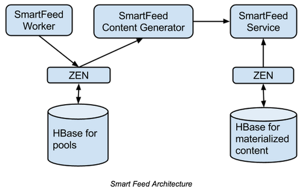

#Pinterest的Feed架构与算法

Pinterest首页的Feed消息流，最早是按照用户的关注对象的Pin（类似微博）聚合后按时间进行排序（自然序，类似朋友圈），后来版本的feed系统放弃了自然序，而是根据一定规则及算法来设计，内部称之为Smart feed，其算法及架构根据其公开资料整理如下，值得业界做信息流产品的技术架构师参考。

Pinterest每个用户的首页feed都是个性化内容。Pinterest系统大约1/3流量都指向feed页面，因此它是整个系统最关键的页面之一。当工程师开发新版Smart Feed时，如何达到99.99%可用性也是衡量项目是否成功的指标之一。

Pinterest smart feed的主要算法及规则如下

- 不同来发表来源的Pin按照不同的频次聚合。
- 将Pin按照算法及权重有选择的去除（或延迟加载），质量较低的发表来源不必每次显示全部，系统可以有选择的决定哪些立即出现，哪些延迟显示。Pin的质量都是从当前接收用户的角度来衡量。
- Pin排序的逻辑是最好的优先，而不是最新的优先。一些发表来源的Pin可能最新的优先，但另外一些发表来源的可能新的Pin优先级低。

Pinterest Feed如图所示主要由以下几部分构成，最左边是数据来源，最右边是用户看到的Pinterest瀑布流。中间的三个服务介绍如下。

##Feed worker

Feed worker职责：接收新的pin并根据接收的用户的不同赋予pin权重并保存。同一个Pin，不同的接收用户有不同的权重打分。  
新的pin主要有三个来源：关注用户，相关内容，关注关系的感兴趣内容。Worker会给每个来源的pin打分之后插入到一个pool里面，每个Pool是针对单个用户的优先队列（Priority Queue，即优先级高的内容先出）。  
由于Feed Worker按照接收用户的维度存储，因此所有的pin进入worker时候已经按照关注关系进行分发（即行内通常说的Feed推模式）  

##Feed content generator

Feed content generator负责返回用户上次访问后新的pin。Content Generator可以返回前n条或者全部新的pin，用户获取过（即浏览过）的pin会从pool中删除。Content Generator可以将多个发表源的pin按照一定规则重新排列，但是不能改变原来的Priority Queue返回的优先顺序。即队列中高优先级的会被优先取出。

##Smart feed service  

物化视图用于保存用户上次feed列表的快照。此服务不需要对feed的重新排序，它将上次返回给用户的pin按照当时的顺序完整保存，由于它属于用户已阅读过的历史列表，读写较少，因此它可以提供更好的可用性。另外由于可以限制历史列表的长度，存储空间可控，因此可以更低成本来增加从库来提高访问的可用性。

Feed依赖content generator来提供新的Pin,如果content generator不可用，服务可以优雅的降级，用户仍然可以获取历史的列表，返回物化存储的结果。

Pinterest通过以上3个不同的服务，实现了对feed返回内容灵活的控制，每个服务都有自己明确的职责，达到了每个用户都具备个性化返回内容的目标。

##Feed存储

Pinterest的feed存储需要解决以下几个需求：

- 写入新发表的feed，由于Pinterest采用的是推模式，这个场景需要面临需要高的写入QPS，但用户能容忍一定的写入延迟。
- 获取首页的物化feed列表，相对与写入的QPS要小很多，但是用户对请求的延迟容忍度低。
- 删除feed。

可以采用简单的设计方法，比如将所有的feed写入到一个存储，可以简单实现访问、更新及删除功能。在Pinterest当前的访问规模有上百T的数据以及每秒百万访问操作。经过综合评估，选择使用HBase来实现了上述需求，Pinterest业务场景需要提供非常高的读写及更新操作，HBase同时提供较高的读写及更新访问性能。

用户发表一个新的Pin时，将Pin分发给他所有的粉丝，他的粉丝可能被shard到所有的HBase region上，因此一个分发操作可能要访问到多个region，并锁定每个region的WAL日志，然后进行更新再解锁。每次的write/delete/update操作锁定WAL非常低效，而且很快成为系统的瓶颈。更好的方法是将HBase的操作批量进行，并且可以加大HBase的吞吐能力，但另外一方面增加了访问的时延latency，如果是面向用户请求的操作，访问时延增大是不能接受的。

为了满足不同的需求，Pinterest设计使用了双HBase集群的方法，将数据在不同的阶段写入到不同的HBase集群的方法，请参考图示。

  

Zen是一个在HBase基础上提供图(Graph)存储的服务。
SmartFeed Worker将用户发表的内容分发后通过Zen保存在HBase中，异步处理任务通过PinLater服务来调用。  
SmartFeed ContentGenerator负责返回最新的Pin，并进行评分及排序。  
当用户刷新请求自己首页的feed时，SmartFeed服务从Content Generator和物化存储的HBase归并数据返回给用户，如果生成服务请求超时，则系统仍然可以返回物化存储的数据给用户。在后台，SmartFeed将物化存储的数据从左边的存储删除。  
在实际的场景中，物化存储HBase的数据远远要比发表池的数据要少，这样请求的速度会非常快

##Feed的高可用

使用上述设计后，系统的可用性相当于物化存储HBase的可用性。HBase集群目前存在GC卡顿的风险，还有单点故障region迁移等问题，因此使用单一的HBase集群，可用性很难保证99.99%以上。  

为了解决这个问题，在另外一个EC2可用区启用一个备用集群，任何写入到主集群的数据将会在数百毫秒内同步到另外一个集群上。当主集群不可用时，可以从备用集群返回用户请求的数据。通过上述设计，整个系统的可用性达到99.99%以上（不包括写）。

参考资料
[http://pingineering.tumblr.com/post/105293275179/building-a-scalable-and-available-home-feed](http://pingineering.tumblr.com/post/105293275179/building-a-scalable-and-available-home-feed)  
[https://engineering.pinterest.com/blog/building-scalable-and-available-home-feed](https://engineering.pinterest.com/blog/building-scalable-and-available-home-feed)