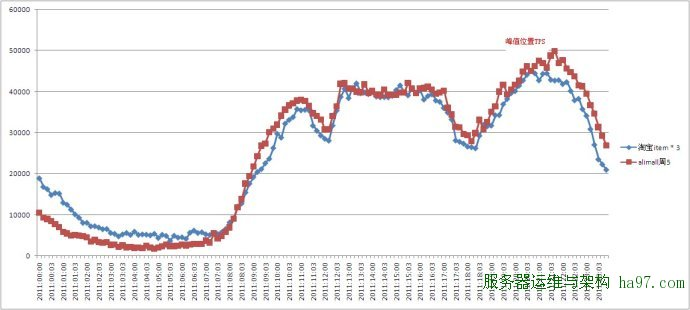
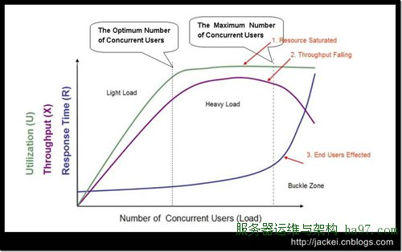

###系统吞吐量、TPS（QPS）、用户并发量、性能测试概念和公式

PS：下面是性能测试的主要概念和计算公式，记录下：

一．系统吞度量要素：

  一个系统的吞度量（承压能力）与request对CPU的消耗、外部接口、IO等等紧密关联。单个reqeust 对CPU消耗越高，外部系统接口、IO影响速度越慢，系统吞吐能力越低，反之越高。

系统吞吐量几个重要参数：QPS（TPS）、并发数、响应时间

        QPS（TPS）：每秒钟request/事务 数量

        并发数： 系统同时处理的request/事务数

        响应时间：  一般取平均响应时间

（很多人经常会把并发数和TPS理解混淆）

理解了上面三个要素的意义之后，就能推算出它们之间的关系：
QPS（TPS）= 并发数/平均响应时间    或者   并发数 = QPS*平均响应时间
        一个典型的上班签到系统，早上8点上班，7点半到8点的30分钟的时间里用户会登录签到系统进行签到。公司员工为1000人，平均每个员上登录签到系统的时长为5分钟。可以用下面的方法计算。
QPS = 1000/(30*60) 事务/秒
平均响应时间为 = 5*60  秒
并发数= QPS*平均响应时间 = 1000/(30*60) *(5*60)=166.7  

   一个系统吞吐量通常由QPS（TPS）、并发数两个因素决定，每套系统这两个值都有一个相对极限值，在应用场景访问压力下，只要某一项达到系统最高值，系统的吞吐量就上不去了，如果压力继续增大，系统的吞吐量反而会下降，原因是系统超负荷工作，上下文切换、内存等等其它消耗导致系统性能下降。

决定系统响应时间要素

我们做项目要排计划，可以多人同时并发做多项任务，也可以一个人或者多个人串行工作，始终会有一条关键路径，这条路径就是项目的工期。

系统一次调用的响应时间跟项目计划一样，也有一条关键路径，这个关键路径是就是系统影响时间；

关键路径是有CPU运算、IO、外部系统响应等等组成。

二．系统吞吐量评估：

我们在做系统设计的时候就需要考虑CPU运算、IO、外部系统响应因素造成的影响以及对系统性能的初步预估。

而通常境况下，我们面对需求，我们评估出来的出来QPS、并发数之外，还有另外一个维度：日PV。

通过观察系统的访问日志发现，在用户量很大的情况下，各个时间周期内的同一时间段的访问流量几乎一样。比如工作日的每天早上。只要能拿到日流量图和QPS我们就可以推算日流量。

通常的技术方法：

  1. 找出系统的最高TPS和日PV，这两个要素有相对比较稳定的关系（除了放假、季节性因素影响之外）

  2. 通过压力测试或者经验预估，得出最高TPS，然后跟进1的关系，计算出系统最高的日吞吐量。B2B中文和淘宝面对的客户群不一样，这两个客户群的网络行为不应用，他们之间的TPS和PV关系比例也不一样。

A)淘宝

淘宝流量图：

淘宝的TPS和PV之间的关系通常为  最高TPS：PV大约为 1 : 11*3600 （相当于按最高TPS访问11个小时，这个是商品详情的场景，不同的应用场景会有一些不同）

B) B2B中文站

B2B的TPS和PV之间的关系不同的系统不同的应用场景比例变化比较大，粗略估计在1 : 8个小时左右的关系（09年对offerdetail的流量分析数据）。旺铺和offerdetail这两个比例相差很大，可能是因为爬虫暂的比例较高的原因导致。

在淘宝环境下，假设我们压力测试出的TPS为100，那么这个系统的日吞吐量=100*11*3600=396万

这个是在简单（单一url）的情况下，有些页面，一个页面有多个request，系统的实际吞吐量还要小。

无论有无思考时间（T_think），测试所得的TPS值和并发虚拟用户数(U_concurrent)、Loadrunner读取的交易响应时间（T_response）之间有以下关系（稳定运行情况下）：
TPS=U_concurrent / (T_response+T_think)。

并发数、QPS、平均响应时间三者之间关系

上图横坐标是并发用户数。绿线是CPU使用率；紫线是吞吐量，即QPS；蓝线是时延。
    开始，系统只有一个用户，CPU工作肯定是不饱合的。一方面该服务器可能有多个cpu，但是只处理单个进程，另一方面，在处理一个进程中，有些阶段可能是IO阶段，这个时候会造成CPU等待，但是有没有其他请 求进程可以被处理）。随着并发用户数的增加，CPU利用率上升，QPS相应也增加（公式为QPS=并发用户数/平均响应时间。）随着并发用户数的增加，平均响应时间也在增加，而且平均响应时间的增加是一个指数增加曲线。而当并发数增加到很大时，每秒钟都会有很多请求需要处理，会造成进程（线程）频繁切换，反正真正用于处理请求的时间变少，每秒能够处 理的请求数反而变少，同时用户的请求等待时间也会变大，甚至超过用户的心理底线。
来源：http://www.cnblogs.com/jackei/

软件性能测试的基本概念和计算公式
一、软件性能的关注点

对一个软件做性能测试时需要关注那些性能呢？

我们想想在软件设计、部署、使用、维护中一共有哪些角色的参与，然后再考虑这些角色各自关注的性能点是什么，作为一个软件性能测试工程师，我们又该关注什么？

首先，开发软件的目的是为了让用户使用，我们先站在用户的角度分析一下，用户需要关注哪些性能。

对于用户来说，当点击一个按钮、链接或发出一条指令开始，到系统把结果已用户感知的形式展现出来为止，这个过程所消耗的时间是用户对这个软件性能的直观印象。也就是我们所说的响应时间，当相应时间较小时，用户体验是很好的，当然用户体验的响应时间包括个人主观因素和客观响应时间，在设计软件时，我们就需要考虑到如何更好地结合这两部分达到用户最佳的体验。如：用户在大数据量查询时，我们可以将先提取出来的数据展示给用户，在用户看的过程中继续进行数据检索，这时用户并不知道我们后台在做什么。

用户关注的是用户操作的相应时间。

其次，我们站在管理员的角度考虑需要关注的性能点。

1、 相应时间
2、 服务器资源使用情况是否合理
3、 应用服务器和数据库资源使用是否合理
4、 系统能否实现扩展
5、 系统最多支持多少用户访问、系统最大业务处理量是多少
6、 系统性能可能存在的瓶颈在哪里
7、 更换那些设备可以提高性能
8、 系统能否支持7×24小时的业务访问

再次，站在开发（设计）人员角度去考虑。

1、 架构设计是否合理
2、 数据库设计是否合理
3、 代码是否存在性能方面的问题
4、 系统中是否有不合理的内存使用方式
5、 系统中是否存在不合理的线程同步方式
6、 系统中是否存在不合理的资源竞争

那么站在性能测试工程师的角度，我们要关注什么呢？

一句话，我们要关注以上所有的性能点。

二、软件性能的几个主要术语

1、响应时间：对请求作出响应所需要的时间

网络传输时间：N1+N2+N3+N4

应用服务器处理时间：A1+A3

数据库服务器处理时间：A2

响应时间=N1+N2+N3+N4+A1+A3+A2

2、并发用户数的计算公式

系统用户数：系统额定的用户数量，如一个OA系统，可能使用该系统的用户总数是5000个，那么这个数量，就是系统用户数。

同时在线用户数：在一定的时间范围内，最大的同时在线用户数量。
同时在线用户数=每秒请求数RPS（吞吐量）+并发连接数+平均用户思考时间

平均并发用户数的计算：C=nL / T

其中C是平均的并发用户数，n是平均每天访问用户数（login session），L是一天内用户从登录到退出的平均时间（login session的平均时间），T是考察时间长度（一天内多长时间有用户使用系统）

并发用户数峰值计算：C^约等于C + 3*根号C

其中C^是并发用户峰值，C是平均并发用户数，该公式遵循泊松分布理论。

3、吞吐量的计算公式

指单位时间内系统处理用户的请求数

从业务角度看，吞吐量可以用：请求数/秒、页面数/秒、人数/天或处理业务数/小时等单位来衡量

从网络角度看，吞吐量可以用：字节/秒来衡量

对于交互式应用来说，吞吐量指标反映的是服务器承受的压力，他能够说明系统的负载能力

以不同方式表达的吞吐量可以说明不同层次的问题，例如，以字节数/秒方式可以表示数要受网络基础设施、服务器架构、应用服务器制约等方面的瓶颈；已请求数/秒的方式表示主要是受应用服务器和应用代码的制约体现出的瓶颈。

当没有遇到性能瓶颈的时候，吞吐量与虚拟用户数之间存在一定的联系，可以采用以下公式计算：F=VU * R /

其中F为吞吐量，VU表示虚拟用户个数，R表示每个虚拟用户发出的请求数，T表示性能测试所用的时间

4、性能计数器

是描述服务器或操作系统性能的一些数据指标，如使用内存数、进程时间，在性能测试中发挥着“监控和分析”的作用，尤其是在分析统统可扩展性、进行新能瓶颈定位时有着非常关键的作用。

资源利用率：指系统各种资源的使用情况，如cpu占用率为68%，内存占用率为55%，一般使用“资源实际使用/总的资源可用量”形成资源利用率。

5、思考时间的计算公式

Think Time，从业务角度来看，这个时间指用户进行操作时每个请求之间的时间间隔，而在做新能测试时，为了模拟这样的时间间隔，引入了思考时间这个概念，来更加真实的模拟用户的操作。

在吞吐量这个公式中F=VU * R / T说明吞吐量F是VU数量、每个用户发出的请求数R和时间T的函数，而其中的R又可以用时间T和用户思考时间TS来计算：R = T / TS

下面给出一个计算思考时间的一般步骤：

A、首先计算出系统的并发用户数

C=nL / T F=R×C

B、统计出系统平均的吞吐量

F=VU * R / T R×C = VU * R / T

C、统计出平均每个用户发出的请求数量

R=u*C*T/VU

D、根据公式计算出思考时间

TS=T/R