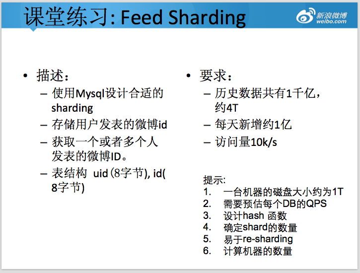
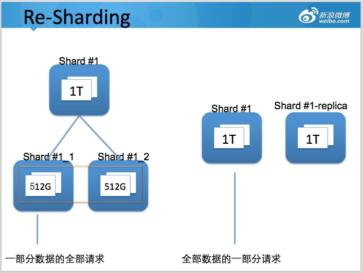
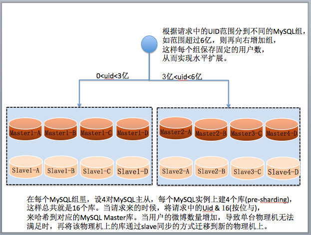
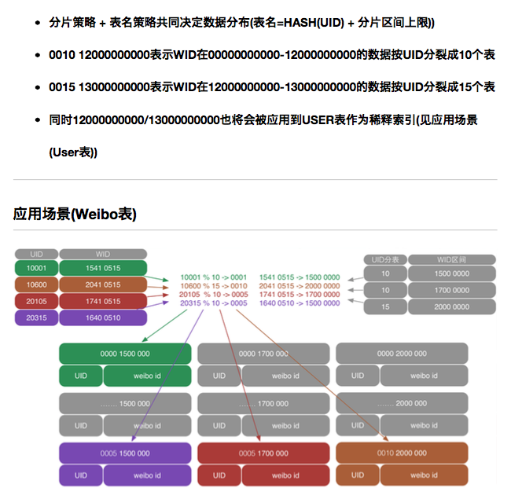

#微博分布式存储作业实现方法

可能通过「高可用架构」听说过在微博的系统中，单张 MySQL 在线业务表 60 亿条数据的场景。很多关注互联网架构的工程师也非常关注如何如何设计类似系统。下面是一道微博新兵训练营的分布式存储课堂练习，要设计合格才能上岗。

考虑到网上有很多架构师也在讨论，补充题目一些说明如下。

###1.访问场景
由于上面题目的应用场景，用户一般情况下，主要查看用户查看自己收到的最新的微博，以及某个特定用户 profile 的所有微博。

- 收到的微博，考虑微博以拉为主的模式，则需要访问关注用户最近 n 条最新的微博。
- 用户 profile，需要访问用户历史上所有发表的微博，而且支持分页查看，可以直接跳转到某一页或者某个时间段，因此需要适当考虑分页的效率（可参考扩展阅读）。

###访问特征

- 从上面描述以及社交网络的用户访问特点来看，用户大部分情况( > 90% )是访问最近 7 天的数据。

不需要考虑的点

- 此题主要是存储层的设计，因此不需要考虑缓存如何设计。
- 由于微博是异步写入的，在某种程度可以起到错峰作用，所以作业暂时不需要考虑写入的峰值。
- 不需要考虑 id 如何产生，假定已经有发号服务。
- 不需要考虑用户收到的微博怎么聚合，那个是更上层服务层的职责。

###2.设计需要考虑的点
Scale-out 扩展性

- 将数据拆分到多个独立的单元存储
- 可以在适当时机进一步拆分，拆分时候需要继续提供在线访问
- 存储在廉价硬件上，考虑到数据规模比较大，需要适当考虑方案的整体成本，因此不要假定默认全部使用 SSD 存储。

###Cost 成本

- 不同访问级别的数据存储在不同访问速度（成本）的硬件上。

###High availability 高可用，以及 Reliability 可靠性 – 复制

在当前场景下，主要通过 MySQL replication 来解决可用性、以及分担读的请求。

###3. Sharding 策略

###Shard 常用策略

range based：根据用户 uid 来分布，相邻 uid 的数据保存在一起。
hash based：根据某个 hash 函数，将一个用户 uid 的数据保存在指定的分片。

###Re-Sharding 拆分设计
当数据持续增长，原先存储的数据（或者访问量）超过当前节点的容量上限，则需要对节点进行进一步拆分。

如何确定shard数量

db buffer > hot data

容量规划

- 预规划: 容纳未来一段时间的数据
- 2 的指数倍: shard 数量变更简单
###Tradeoff

- 分片多：影响 IO 效率;
- 分片少：扩容频繁、复杂

##4、部分投稿案例
案例一：使用 user id range 作为分片

案例二：使用user id hash作为分片

>方案三 （via 张亮）
历史数据：
1. 每半年根据日期分库，如：2015.01-2015.06为一个库。每天增加1亿数据，半年180亿，约为0.72T数据，可以保留在1T的磁盘中。  
2. 根据 uid 取模分库（表），便于查询和分散数据。 当前 n 日数据：  
1. 暂定n为10，存储10亿数据。  
2. 根据uid + 权重的hash算法分库。权重可以根据每个uid的微博id数量，粉丝数等指标离线计算。 hash算法需保证：  
1. 同一uid需落在一个库。  
2. 权重接近的用户尽量均匀的落在不同库。  
3. 为了应对突然发生的事件导致访问量激增，需要考虑2级甚至3级分片，而不宜直接做re-sharding导致数据迁移。多级分片可考虑读取一个标记，放在zk中。根据标记确定分片的hash算法加入小时等维度。 查询索引：  
1. 增加发帖索引字段，记录每个用户的每个帖子的索引。  
2. 增加发帖总数统计表，以用户为维度，每个用户发一次贴则发帖总数++。  
3. 增加二级索引表，记录每个用户，每次分片库的发帖索引。如：uid 1的用户，在2015年第一帖是该用户发帖的总数的第10贴，2015年最后一贴是该用户发帖总数的第50贴。  
4. 分页查询使用二级索引表，先查到该查哪个真实库（可能是多个），再到真实库中获取数据。 总结：  
1. 通过灵活的运用时间维度分片，免去因uid分片数量不足导致的大规模迁移，使用外部flag灵活的控制分片策略。而且用时间维度分片更易做到冷热分离。  
分片逻辑可以灵活到，zk中记录时间段，某个时间段内，按月分，某个时间段，按年分，之类。
2. 通过离线计算权重的方式均匀分散数据访问。权重周期性调整，对于调整权重的用户，需要重点考虑当前n日数据的数据迁移方案。但由于调整权重的用户属于少量，所以迁移应该数据变动较小。历史数据不需权重概念，无需数据迁移。  
3. 查询使用二级索引。使用修改btree结构去掉二级索引能有效减少数据量，但实现难度较大，可以在之后的局部优化中实现，对总体数据库结构影响不大。  
4. 将前n日数据和当天数据整合在一起，之前对微博的场景理解不深，以为有首屏显示这样的概念。  